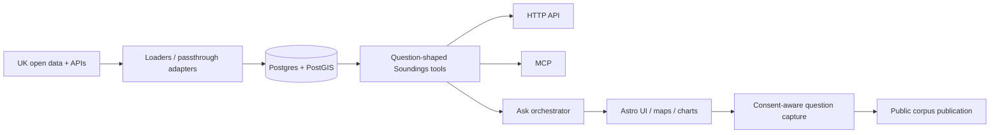

# Soundings — current state

> Last updated: **29 August 2026**
>
> Current position: **Phase 6 consolidation complete; depth shipped, breadth continuing.**

This file is the canonical short-form statement of what is actually implemented. Older phase plans in `docs/plans/` are useful design history, but should not be read as the current status.

## Repository health

The 29 August consolidation established a clean baseline:

- **PR #31** fixes the nightly workflow so destructive/live tests use the isolated `soundings_test` database rather than the development database.
- **PR #33** reconciles code/test drift from the July civil-society and multi-turn work.
- PR #33 is green across:
  - Python lint + formatting + strict mypy;
  - server unit/integration test job;
  - Astro/TypeScript typecheck + UI tests.
- The corrected nightly workflow was exercised manually on **29 August 2026**. The first real run exposed upstream drift; after fixes, a fresh live run passed with **12 passed, 2 skipped, 648 deselected**.
- The two skips are credential-gated checks: Stat-Xplore and the live Ask/Anthropic smoke. They skip cleanly when their GitHub secrets are unavailable.
- Live validation also updated three source assumptions: DfE pagination now follows the current POST-body contract; Police.uk backs off and retries rate limiting; Find That Charity uses its current v1 direct-lookup API.

## Product state

### Phase 0–5

Complete. These phases established:

- the geography spine and catalogue;
- Postgres/PostGIS storage and migrations;
- loader/passthrough adapter architecture;
- HTTP + MCP transports;
- place profiles, comparisons and trends;
- consent-aware question capture and sanitisation;
- the public corpus publication path;
- civil-society organisation and grant data;
- the first production UI and charting layer.

### Phase 6a — depth

Shipped.

- `/v1/ask` tool-use orchestration and `/ask` UI.
- Typed answer blocks for prose, indicator cards, charts, maps, organisations and neighbourhood tables.
- Multi-turn follow-up questions with stored conversation/place context.
- LSOA/ward neighbourhood analysis through `get_sub_areas`.
- Give Food point data for food-bank questions.
- Richer civil-society profiles, cause classifications, notable organisations and operating-area context.
- Guardrails preventing unsuitable indicators from producing broken choropleths.

### Phase 6b — breadth

Partially shipped and still the natural data-expansion track.

Implemented sources include, alongside the earlier ONS/IMD/OHID/DfE/Police/Charity Commission/360Giving stack:

- Companies House;
- Friends of the Earth green-space data;
- OpenWeather/CAMS-modelled air quality;
- Sport England Active Lives;
- NSPL/postcode enrichment.

Additional housing, environment, transport, digital and service-quality sources remain candidates rather than assumed commitments.

**Find That Charity capability note:** the current v1 API supports direct charity lookup, but no longer exposes the filtered country/place search Soundings originally used for Scottish and Northern Irish local-authority discovery. That place-discovery path now fails closed (returns no organisations) rather than presenting national results as local. A replacement area-discovery source is needed before that capability can be restored.

## Architecture

The catalogue remains the contract: source/indicator definitions determine what adapters can serve and what the UI/model should be allowed to request.

## Operational boundary

Generic infrastructure stays public in `soundings/infra`.

The private `soundings-ops` repository is for the operated instance only: encrypted environment material, host-specific deployment settings, backups/restores and private operational notes. The public repository must remain sufficient to understand and reproduce the software without exposing those instance details.

## Known follow-ups

These are the repo-level follow-ups that remain after consolidation:

1. **Add/refresh live-source credentials** if the Stat-Xplore and Anthropic nightly smokes should run rather than skip.
2. **Replace Scottish/NI organisation place discovery** with a source that genuinely supports area-level lookup; FTC direct lookup alone is not sufficient.
3. **Continue Phase 6b selectively** rather than adding sources simply for breadth; prioritise data that improves real place questions.
4. **Keep TypeScript/Pydantic mirrors together** whenever organisation or answer-block contracts change.
5. **Retire stale branches deliberately.** Several branches have no commits ahead of `main`; squash-merged branches can appear technically divergent even where their content is already present. Compare before deleting rather than reviving old branches.

## Branch notes from the consolidation

Clearly superseded/represented on `main` include the completed chart, corpus-homepage, Phase 4 FTC and Ask grant-steering branches, plus the Good Ship analytics branch and the nightly fix branch.

The old Ask timeout/choropleth branch is also superseded: its safeguards are already present on current `main`, which has subsequent follow-up work on top.

The NSPL/recovery branches should be compared file-by-file before deletion because later fixes were layered across several branches.

`claude/blog-repo-approach-96xj5i` contains unique blog/diagram draft material and should be preserved until that material is intentionally merged or discarded.
