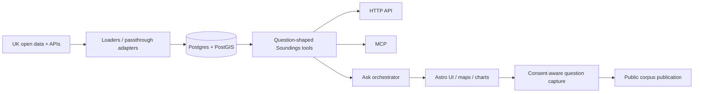

# Soundings — current state

> Last updated: **29 August 2026**
>
> Current position: **Phase 6.5 started — questions before sources — and Phase 7 (Observations MVP) shipped**, merged in from `feat/observations-mvp`.

This file is the canonical short-form statement of what is actually implemented. Older phase plans in `docs/plans/` are useful design history, but should not be read as the current status.

## Repository health

The 29 August consolidation established a clean baseline:

- **PR #31** fixes the nightly workflow so destructive/live tests use the isolated `soundings_test` database rather than the development database.
- **PR #33** reconciles code/test drift from the July civil-society and multi-turn work.
- PR #33 is green across:
  - Python lint + formatting + strict mypy;
  - server unit/integration test job;
  - Astro/TypeScript typecheck + UI tests.
- The corrected nightly workflow was exercised manually on **29 August 2026**. The first real run exposed upstream drift; after fixes, a fresh live run passed.
- Stat-Xplore was then enabled with a real Actions secret and its current authenticated schema was verified. The Universal Credit mapping now uses the live `UC_Monthly` local-authority/date IDs and narrows latest-value queries to one month, avoiding the old 60-second full-series timeout.
- The latest live validation passes with **13 passed and 1 deliberate skip**. The skipped check is the live Ask/Anthropic smoke; it is intentionally not being pursued in the current phase.
- Live schema inspection also retired two speculative Stat-Xplore capabilities: `economy.claimant_count_rate` and `deprivation.child_poverty_ahc`. The current DWP products expose Alternative Claimant Count and AHC Relative Low Income as counts; Soundings had advertised proportion-shaped values without a tested denominator/derivation. Those indicators are no longer active until a question-led use case justifies a correct derived measure.
- Live validation also updated source assumptions for DfE pagination, Police.uk rate limiting, Find That Charity v1, and Stat-Xplore's current geography/date schema.

## Product state

### Phase 0–5

Complete. These phases established:

- the geography spine and catalogue;
- Postgres/PostGIS storage and migrations;
- loader/passthrough adapter architecture;
- HTTP + MCP transports;
- place profiles, comparisons and trends;
- consent-aware question capture and sanitisation;
- the public corpus publication path;
- civil-society organisation and grant data;
- the first production UI and charting layer.

### Phase 6a — depth

Shipped.

- `/v1/ask` tool-use orchestration and `/ask` UI.
- Typed answer blocks for prose, indicator cards, charts, maps, organisations and neighbourhood tables.
- Multi-turn follow-up questions with stored conversation/place context.
- Completed first-turn answers are cached for 24 hours with their full tool/message history, so reload/back-navigation can replay instantly without losing follow-up capability.
- The UI keeps a browser-local list of recently completed questions; any cross-user “previously asked” experience should be built from the consented corpus rather than the private answer cache.
- LSOA/ward neighbourhood analysis through `get_sub_areas`.
- Give Food point data for food-bank questions.
- Richer civil-society profiles, cause classifications, notable organisations and operating-area context.
- Guardrails preventing unsuitable indicators from producing broken choropleths.

### Phase 6b — breadth

Partially shipped. It remains available as a data-expansion track, but it is no longer the default next step.

Implemented sources include, alongside the earlier ONS/IMD/OHID/DfE/Police/Charity Commission/360Giving stack:

- Companies House;
- Friends of the Earth green-space data;
- OpenWeather/CAMS-modelled air quality;
- Sport England Active Lives;
- NSPL/postcode enrichment.

Additional housing, environment, transport, digital and service-quality sources remain candidates rather than assumed commitments.

**Find That Charity capability note:** the current v1 API supports direct charity lookup, but no longer exposes the filtered country/place search Soundings originally used for Scottish and Northern Irish local-authority discovery. That place-discovery path now fails closed with an empty organisation list **and `partial: true` plus an explicit coverage caveat**, rather than presenting national results as local or making missing coverage look like a genuine zero. A replacement area-discovery source is needed before that capability can be restored.

## Phase 6.5 — questions before sources

Started on **29 August 2026**.

Soundings now has a curated 30-question evaluation baseline in `evaluation/questions.yaml`. It spans summaries, peer comparisons, neighbourhoods, trends, health, education, housing, crime, civil society, infrastructure, environment and cross-UK coverage.

Each case records:

- whether the current system is expected to be **supported**, **partial** or a known **gap**;
- the Soundings tools and active indicators the question should rely on;
- likely answer-block forms and explicit success criteria;
- known coverage/derived-measure gaps where relevant.

`server/scripts/check_question_set.py` validates the set without an Anthropic key, and CI ensures the baseline references real tools/active indicators and exercises every non-terminal Ask tool.

This is an **evaluation hypothesis set**, not a claim that all 30 questions are currently answered well. The development loop is now: run/inspect questions, classify the failure, fix the smallest reusable capability, then re-run affected questions. New sources should be added because important questions need them, not simply to increase source count.

The live Ask/Anthropic smoke remains deliberately skipped for this phase.

## Phase 7 — Observations MVP

Shipped on `feat/observations-mvp`, merged into this baseline on 29 August 2026.

A hybrid contribution layer sitting alongside the read-only indicator stack: organisations record short, attributed observations (quantitative or qualitative) against a place, a theme and optionally an existing indicator.

- New `catalogue.theme`, `data.observation` and `contribution.contributor_session` tables (migration `0011_observation_schema`, renumbered during the 29 August integration to chain after the Phase 6.5 migrations `0009`/`0010`). 12 initial themes seeded.
- **Hybrid sign-up:** organisations already in `data.organisation` (Charity Commission, FindThatCharity) self-identify via magic-link auth; organisations not in any register get a lightweight profile created on sign-up (`source_id = 'ctx.manual_signup'`). Both paths produce a `data.organisation.id` that observations reference.
- Append-only, auto-accept, public attribution for the MVP — no moderation queue yet.
- `POST /v1/observations` submission endpoint, and `get_observations` surfaced through HTTP, MCP, and the `/v1/ask` dispatcher.
- UI: an observations panel on `/place/[id]`, a public `/observations` stream, and a `/contribute` submission form (with a footer nav link alongside Explore/Corpus/About).
- Plan: `docs/plans/2026-08-24-observations-mvp.md`.

## Architecture

The catalogue remains the contract: source/indicator definitions determine what adapters can serve and what the UI/model should be allowed to request.

## Operational boundary

Generic infrastructure stays public in `soundings/infra`.

The private `soundings-ops` repository is for the operated instance only: encrypted environment material, host-specific deployment settings, backups/restores and private operational notes. The public repository must remain sufficient to understand and reproduce the software without exposing those instance details.

## Known follow-ups

These are the repo-level follow-ups that remain after consolidation:

1. **Keep the Anthropic Ask smoke skipped for now.** The rest of the configured live suite is the active integration gate.
2. **Replace Scottish/NI organisation place discovery** with a source that genuinely supports area-level lookup; FTC direct lookup alone is not sufficient.
3. **Run the Phase 6.5 question baseline and classify failures.** Prioritise fixes that improve several high-value questions.
4. **Reintroduce derived claimant-count / child-poverty rates only if the question baseline justifies them**, with explicit denominators and tests rather than relabelling counts.
5. **Keep TypeScript/Pydantic mirrors together** whenever organisation or answer-block contracts change.
6. **Retire stale branches deliberately.** Several branches have no commits ahead of `main`; squash-merged branches can appear technically divergent even where their content is already present. Compare before deleting rather than reviving old branches.
7. **Observations MVP has no moderation queue.** Append-only/auto-accept was an explicit MVP scope call; revisit once contribution volume makes it necessary.

## Branch notes from the consolidation

Clearly superseded/represented on `main` include the completed chart, corpus-homepage, Phase 4 FTC and Ask grant-steering branches, plus the Good Ship analytics branch and the nightly fix branch.

The old Ask timeout/choropleth branch is also superseded: its safeguards are already present on current `main`, which has subsequent follow-up work on top.

The NSPL/recovery branches should be compared file-by-file before deletion because later fixes were layered across several branches.

`claude/blog-repo-approach-96xj5i` contains unique blog/diagram draft material and should be preserved until that material is intentionally merged or discarded.
